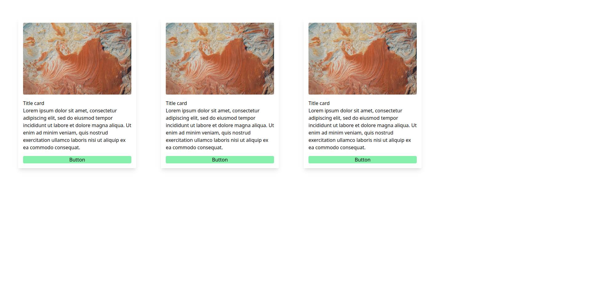

The simple library for an example of declarative web programming, built on React + TailwindCSS. Allows you to write a web application without using html, only Typescript. Similar functionality is present in Flutter.

##Example
```
import './App.css';
import Row from './lib/widgets/Row';
import Text from './lib/widgets/Text';
import Button from './lib/widgets/Button';
import { Rounded } from './lib/widgets/Round';
import { BackGroundColor } from './lib/widgets/BackGroundColor';
import Scaffold from './lib/widgets/Scaffold';
import Margin from './lib/widgets/Styles/Margin';
import Card from './lib/widgets/Card';
import Image from './lib/widgets/Image';
import Width from './lib/widgets/Styles/Width';
import Tailwind from './lib/widgets/Styles/Tailwind';

function App() {

  return (
    Scaffold(
      [
        Row(
          [
            Card([
              Image('image.jpg', 'pictures', [new Margin(0, 0, 0, 4), new Width('w-full'), new Rounded()]),
              Text('Title card'),
              Text('Lorem ipsum dolor sit amet, consectetur adipiscing elit, sed do eiusmod tempor incididunt ut labore et dolore magna aliqua. Ut enim ad minim veniam, quis nostrud exercitation ullamco laboris nisi ut aliquip ex ea commodo consequat.', [new Margin(0, 0, 0, 4)]),
              Button('Button', undefined, [new Rounded(), new BackGroundColor('green-300'), new Width('w-full')])
            ],
              [new Margin(16, 0, 4, 0), new Tailwind('max-w-sm'), new Rounded()]
            ),
            Card([
              Image('image.jpg', 'pictures', [new Margin(0, 0, 0, 4), new Width('w-full'), new Rounded()]),
              Text('Title card'),
              Text('Lorem ipsum dolor sit amet, consectetur adipiscing elit, sed do eiusmod tempor incididunt ut labore et dolore magna aliqua. Ut enim ad minim veniam, quis nostrud exercitation ullamco laboris nisi ut aliquip ex ea commodo consequat.', [new Margin(0, 0, 0, 4)]),
              Button('Button', undefined, [new Rounded(), new BackGroundColor('green-300'), new Width('w-full')])
            ],
              [new Margin(16, 0, 4, 0), new Tailwind('max-w-sm'), new Rounded()]
            ),
            Card([
              Image('image.jpg', 'pictures', [new Margin(0, 0, 0, 4), new Width('w-full'), new Rounded()]),
              Text('Title card'),
              Text('Lorem ipsum dolor sit amet, consectetur adipiscing elit, sed do eiusmod tempor incididunt ut labore et dolore magna aliqua. Ut enim ad minim veniam, quis nostrud exercitation ullamco laboris nisi ut aliquip ex ea commodo consequat.', [new Margin(0, 0, 0, 4)]),
              Button('Button', undefined, [new Rounded(), new BackGroundColor('green-300'), new Width('w-full')])
            ],
              [new Margin(16, 0, 4, 0), new Tailwind('max-w-sm'), new Rounded()]
            ),
          ],
          [new Margin(0,16,0,0)]
        ),
      ]
    )
  );
}

export default App;

```

##Output


#### Available Scripts

In the project directory, you can run:

### `yarn start`

Runs the app in the development mode.\
Open [http://localhost:3000](http://localhost:3000) to view it in the browser.

The page will reload if you make edits.\
You will also see any lint errors in the console.